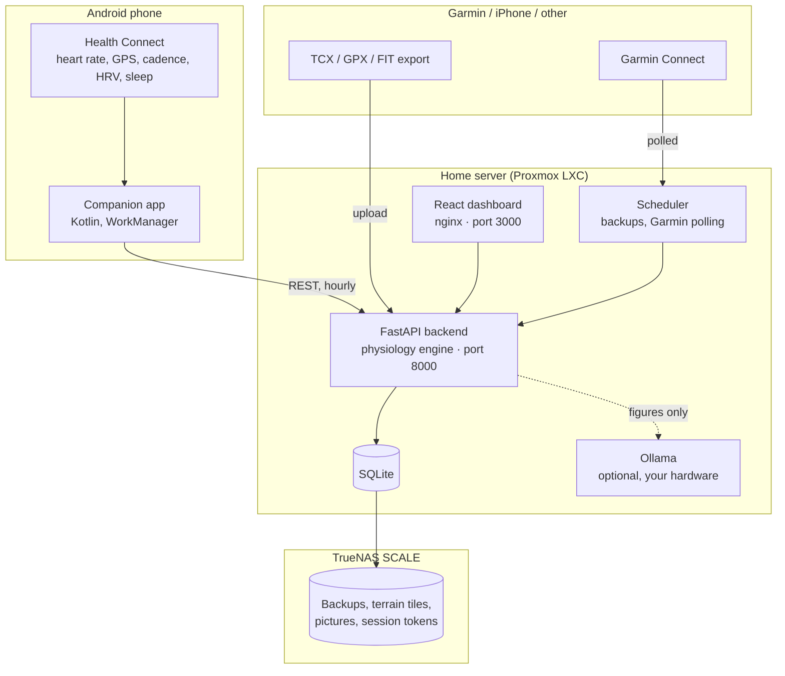

# Performance

Self-hosted training analytics. It reads your activities from **Android Health Connect** or **Garmin Connect**, computes exercise-physiology metrics from them, and keeps every byte on your own server.

Built to run on a **Proxmox LXC container** backed by **TrueNAS SCALE**, but it is an ordinary Docker Compose stack and will run anywhere Docker does.

Two principles run through the whole thing:

**Each sport is kept separate.** Walks and gym sessions are recorded and shown, but they do not set running records and they do not drive the running fitness curve. A 10:31/km walk is not a slow run.

**A missing number is shown as missing.** Where the data cannot support a metric, the app says so and says why, rather than showing a plausible figure. Every activity records which channels were measured, how well they were covered, and which values were estimated.

---

## What it does

| | |
| :-- | :-- |
| **Ingest** | Android companion app reading Health Connect; automatic Garmin Connect sync; TCX, GPX, FIT and zip import |
| **Analyse** | Aerobic decoupling, grade-adjusted pace, rTSS, TRIMP, heart-rate zones, best efforts, training effect, recovery |
| **Track** | Banister fitness/fatigue/form curve, personal records, XP and levels, achievements |
| **Review** | Weekly, monthly and yearly recaps with period-on-period comparison; printable PDF reports |
| **Comment** | Optional written coaching from a language model running on your own hardware |
| **Manage** | Multiple accounts with separate data, an admin console, automatic dated backups |
| **Personal** | Optional menstrual cycle tracking, per account and off by default |

---

## Quick start

On a machine with Docker:

```bash
git clone git@github.com:pereira-fabio/performance.git /opt/peakpace
cd /opt/peakpace
docker compose up -d --build
```

- **Dashboard** — `http://<server>:3000`
- **API and Swagger docs** — `http://<server>:8000/docs`

Open the dashboard and register. **The first account created becomes the administrator** and claims any activities that were already in the database.

Then pick how your activities get in:

- **Android** — build and install the companion app, grant Health Connect permissions, point it at `http://<server>:8000`. See [Data sources](docs/data-sources.md#android-health-connect).
- **Garmin, including on iPhone** — sign in under Settings → Automatic sync and it polls for you. See [Data sources](docs/data-sources.md#garmin-connect).
- **Anything else** — export TCX, GPX or FIT and drop the files into the importer. See [Data sources](docs/data-sources.md#file-import).

Full deployment instructions, including Proxmox and TrueNAS, are in [Installation](docs/installation.md).

---

## Documentation

| Document | What is in it |
| :-- | :-- |
| [Installation](docs/installation.md) | Proxmox LXC, TrueNAS storage, Docker Compose, every configuration variable |
| [Data sources](docs/data-sources.md) | Health Connect, Garmin, file import, and how ingestion handles duplicates and bad data |
| [Metrics](docs/metrics.md) | Every figure the app computes, the formula behind it, and when it refuses to compute one |
| [Reports and coaching](docs/reports.md) | Weekly recaps, PDF reports, and the local language model |
| [Accounts and privacy](docs/accounts.md) | Accounts, the admin console, backups, cycle tracking, and exactly what is stored where |
| [API reference](docs/api.md) | Every endpoint |
| [Development](docs/development.md) | Repository layout, building the app, deploying, maintenance scripts, troubleshooting |

---

## How it compares

| | Strava | Performance |
| :-- | :-- | :-- |
| Aerobic decoupling (Pa:HR) | Not available | Built in |
| Fitness / fatigue / form | Paywalled, simplified | Full Banister model with ACWR |
| Grade-adjusted pace | Proprietary | Minetti et al. (2002), documented |
| Elevation when the watch records none | Not recovered | Recovered from a local terrain model |
| Data quality | Not reported | Per-channel coverage on every activity |
| Written coaching | Paywalled, cloud | Your own model, on your own hardware |
| Where your GPS traces live | Their cloud | Your server, and nowhere else |
| Cost | Subscription | Free and open source |

---

## Architecture



---

## Tech stack

- **Backend** — Python 3.12, FastAPI, SQLAlchemy, Pydantic v2, NumPy, SciPy, ReportLab, Uvicorn
- **Frontend** — React 18, Vite, TypeScript, Tailwind CSS, Recharts, React-Leaflet
- **Mobile** — Kotlin, Jetpack Compose, Health Connect client, WorkManager, OkHttp
- **Infrastructure** — Docker Compose, nginx, SQLite in WAL mode, Proxmox LXC, TrueNAS SCALE

## Licence

See [LICENSE](LICENSE).
