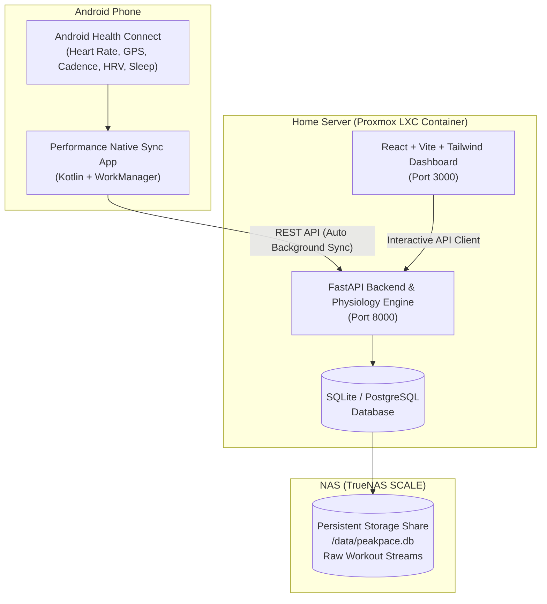

# Performance

Self-hosted training analytics. Reads running, walking and gym sessions from **Android Health Connect**, computes exercise-physiology metrics from them, and keeps every byte on your own server.

Each sport is kept separate: walks and gym work are recorded and shown, but they do not set running records or drive the running fitness curve. Where the data cannot support a metric, the app says so rather than showing a plausible number.

Hosted directly on your **Proxmox LXC container** and backed by **TrueNAS SCALE** storage, Performance gives you professional-grade insights into your aerobic base, cardiac drift, and fatigue management.

---

## 🌟 Why Performance Beats Strava

| Feature | Strava (Free/Paid) | Performance |
| :--- | :--- | :--- |
| **Aerobic Decoupling ($Pa:HR$)** | ❌ Not available | ✅ **Built-in ($EF_1$ vs $EF_2$ split drift)** |
| **Performance Management Chart (PMC)** | 🔒 Paywalled & simplified | ✅ **Full Banister Model (CTL, ATL, TSB, ACWR)** |
| **Grade-Adjusted Pace (GAP)** | 🔒 Proprietary black-box | ✅ **Minetti et al. (2002) Metabolic Equation** |
| **Recovery & HRV Correlation** | ❌ Not supported | ✅ **Health Connect HRV RMSSD, RHR & Sleep** |
| **Cadence & Stride Length Dynamics** | Basic | ✅ **Continuous stride length & SPM analysis** |
| **Data Privacy & Storage** | ☁️ Proprietary cloud | 🏠 **100% Self-Hosted on Proxmox & TrueNAS** |
| **Subscription Cost** | $80+/year | 🆓 **Free & Open Source Forever** |

---

## 🏗️ System Architecture



---

## 🔬 Scientific Physiology Metrics Included

### 1. Aerobic Decoupling ($Pa:HR$ Drift)
Measures the cardiovascular efficiency across your run by comparing Aerobic Efficiency ($EF = \frac{\text{Speed}}{\text{HR}}$) in the first half vs the second half:
$$\text{Decoupling Drift } (\%) = \left(1 - \frac{EF_2}{EF_1}\right) \times 100$$
- **$< 3\%$**: Elite aerobic efficiency / negligible cardiac drift.
- **$3\% - 5\%$**: Well-trained aerobic base.
- **$> 5\%$**: Significant cardiac drift (fatigue, dehydration, heat, or running above aerobic threshold).

### 2. Minetti Grade-Adjusted Pace (GAP)
Converts slope running speed into flat-ground equivalent speed using the 5th-order polynomial energy cost formula from *Minetti et al. (2002)*:
$$C_r(i) = 155.4 i^5 - 30.4 i^4 - 43.3 i^3 + 46.3 i^2 + 19.5 i + 3.6 \quad (\text{J/kg}\cdot\text{m})$$

### 2b. Terrain Elevation Recovery (DEM)
Many wearables write **no altitude at all** to Health Connect — Nothing X, for example, records a constant `0.0` for every route point, and writes no `ElevationGainedRecord`. Without elevation there is no grade, and without grade GAP is undefined.

Performance therefore recovers elevation from the GPS track against a local **SRTM digital elevation model**:

- Bilinear interpolation between DEM posts (nearest-neighbour would stair-step and manufacture false grade spikes).
- The profile is smoothed over ~60 m of track, then ascent is accumulated with a 3 m threshold. Summing raw differences counts measurement noise as climbing — on a profile carrying 2 m of jitter that turns a 39 m climb into over 1800 m.
- A device that reports **real** altitude is always preferred; the DEM is only consulted when it does not.
- Tiles are read from local storage, so **GPS traces are never sent to a remote elevation service** — the whole point of self-hosting.
- Each activity records which source was used, the tiles involved, and the resolution, under `data_quality.altitude`.

**Setup:**
```bash
# 1. Find out which tiles your routes need
docker exec -it performance-backend python backend/dem_tiles.py

# 2. Download those tiles and drop them in DEM_DIR (/data/dem by default),
#    as NxxEyyy.hgt or the downloaded NxxEyyy.hgt.zip — both are read directly.

# 3. Re-sync to populate elevation and GAP on existing activities
```
1 arc-second (30 m) tiles resolve grade noticeably better than 3 arc-second (90 m). Both work. If no tile covers a route, elevation and GAP stay unavailable and the activity records exactly why — no fabricated numbers.

### 3. Banister Performance Management Chart (PMC)
Calculates your fitness, fatigue, and form trajectories:
- **Chronic Training Load (CTL / "Fitness")**: 42-day Exponentially Weighted Moving Average (EWMA) of daily rTSS.
- **Acute Training Load (ATL / "Fatigue")**: 7-day EWMA of daily rTSS.
- **Training Stress Balance (TSB / "Form")**: $\text{TSB} = \text{CTL} - \text{ATL}$.
- **Acute:Chronic Workload Ratio (ACWR)**: $\frac{\text{ATL}}{\text{CTL}}$ (optimal safe range $0.8 - 1.3$).

### 4. Running Training Stress Score (rTSS)
Uses 30-second rolling 4th-power Normalized Graded Pace (NGP) relative to your Lactate Threshold Pace.

---

## 🚀 Proxmox LXC & TrueNAS Deployment

### Step 1: Create a Proxmox LXC Container
1. In the Proxmox VE web interface, create a new container (Debian 12 or Ubuntu 22.04/24.04).
2. Allocate **2 vCPUs**, **2 GB RAM**, and **10 GB Disk**.
3. Under **Options** $\rightarrow$ **Features**, enable **Nesting** and **keyctl** (required for Docker inside LXC).

### Step 2: Mount TrueNAS Share into LXC
You can mount your TrueNAS SMB or NFS share either via the Proxmox Host configuration or directly inside the LXC container:

**Option A (Proxmox Host Mount Point):**
Add the following line to `/etc/pve/lxc/<CTID>.conf` on your Proxmox host:
```ini
mp0: /mnt/pve/truenas_share,mp=/data
```

**Option B (Inside LXC fstab):**
```bash
mkdir -p /data
# Mount SMB/CIFS share:
mount -t cifs //truenas.local/bigboy/App/data /data -o username=<USER>,password=<PASS>,uid=1000,gid=1000
```

### Step 3: Run Setup Script or Docker Compose
Inside your LXC container:
```bash
# Clone or navigate to this directory
cd /run/user/1000/gvfs/smb-share:server=truenas.local,share=bigboy/App

# Launch backend and frontend
docker-compose up -d --build
```

The services will be accessible at:
- 🌐 **Web Dashboard:** `http://<PROXMOX_LXC_IP>:3000`
- 🔌 **API & Swagger Docs:** `http://<PROXMOX_LXC_IP>:8000/docs`

---

## 📱 Android Health Connect Companion App

The Android companion application is located in `android-companion/`.

### Features:
- Direct integration with **Android Health Connect** SDK.
- Reads `ExerciseSessionRecord` (Running), `HeartRateRecord`, `SpeedRecord`, `ExerciseRoute` GPS points, and `StepsCadenceRecord`.
- Reads daily recovery data: `HeartRateVariabilityRmssdRecord`, `RestingHeartRateRecord`, and `SleepSessionRecord`.
- Automatic background synchronization using **WorkManager** (runs every hour or post-workout).

### How to Build & Install:
1. Open the `android-companion` folder in **Android Studio**.
2. Connect your Android phone (with USB debugging enabled).
3. Click **Run 'app'** or build the APK via terminal:
   ```bash
   cd android-companion
   ./gradlew assembleDebug
   ```
4. On your phone, open **Performance Sync**, tap **Grant Health Connect Permissions**, and enter your server URL (`http://<YOUR_PROXMOX_IP>:8000`).
5. Tap **Sync Now to Proxmox** — your runs and physiological data will appear on your web dashboard instantly!

---

## 🧪 Seeding Sample Data (Optional)

To test the dashboard immediately with simulated runs showing aerobic decoupling, PRs, and 60 days of PMC history:
```bash
docker exec -it performance-backend python backend/seed_demo_data.py
```

---

## 🛠️ Tech Stack

- **Backend:** Python 3.11, FastAPI, SQLAlchemy, NumPy, SciPy, Pandas, GPXPy, FitParse, Uvicorn
- **Frontend:** React 18, Vite, TypeScript, Tailwind CSS, Leaflet, React-Leaflet, Recharts, Lucide Icons
- **Mobile:** Android SDK 34, Kotlin, Jetpack Compose, Health Connect Client, WorkManager, OkHttp
- **DevOps:** Docker, Docker Compose, Nginx, Proxmox LXC, TrueNAS SCALE
