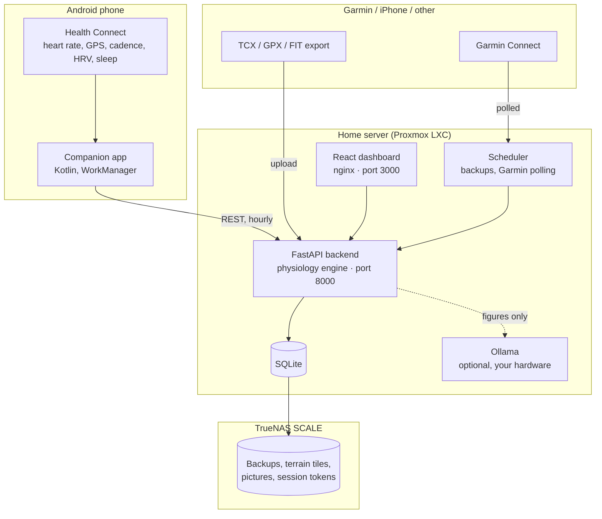

# Performance

Self-hosted training analytics. It reads your activities from **Android Health Connect** or **Garmin Connect**, computes exercise-physiology metrics from them, and keeps every byte on your own server.

Built to run on a **Proxmox LXC container** backed by **TrueNAS SCALE**, but it is an ordinary Docker Compose stack and will run anywhere Docker does.

Three principles run through the whole thing:

**Each sport is kept separate.** Walks and gym sessions are recorded and shown, but they do not set running records and they do not drive the running fitness curve. A 10:31/km walk is not a slow run.

**A missing number is shown as missing.** Where the data cannot support a metric, the app says so and says why, rather than showing a plausible figure. Every activity records which channels were measured, how well they were covered, and which values were estimated. Where a figure is derived rather than measured — an estimated VO₂ max, a training effect — it says that too.

**A week is Monday to Sunday.** Not a rolling seven days. A window that slides forward every morning can never be finished, and "four days trained" needs a seven to count against.

---

## What it does

| | |
| :-- | :-- |
| **Ingest** | Android companion app reading Health Connect; automatic Garmin Connect sync of your whole history; TCX, GPX, FIT and zip import |
| **Analyse** | Aerobic decoupling, grade-adjusted pace, rTSS, TRIMP, heart-rate and pace zones, splits, best efforts, training effect, recovery |
| **Estimate** | Elevation where the watch recorded none, VO₂ max where nothing reported one, body fat from a tape measure |
| **Track** | Banister fitness/fatigue/form curve, the best three at every distance, XP and levels, achievements |
| **Review** | Weekly, monthly and yearly recaps with period-on-period comparison; printable PDF reports |
| **Comment** | Optional written coaching from a language model running on your own hardware — it phrases figures, it never calculates them |
| **Manage** | Multiple accounts with separate data, an admin console, automatic dated backups |
| **Personal** | Optional menstrual cycle tracking, per account and off by default |

---

## Quick start

On a machine with Docker:

```bash
git clone git@github.com:pereira-fabio/performance.git /opt/peakpace
cd /opt/peakpace
docker compose up -d --build
```

- **Dashboard** — `http://<server>:3000`
- **API and Swagger docs** — `http://<server>:8000/docs`

Open the dashboard and register. Registration asks for your name as well as a username, so your profile starts filled in. **The first account created becomes the administrator** and claims any activities that were already in the database.

Then pick how your activities get in:

- **Android** — install the companion app (see [Getting the Android app](#getting-the-android-app)), grant Health Connect permissions, point it at `http://<server>:8000`. See [Data sources](docs/data-sources.md#android-health-connect).
- **Garmin, including on iPhone** — sign in under Settings → Automatic sync and it polls for you every half hour. The first sync pulls your whole account, a batch at a time. See [Data sources](docs/data-sources.md#garmin-connect).
- **Anything else** — export TCX, GPX or FIT and drop them into Settings → Import activities. See [Data sources](docs/data-sources.md#file-import).

Then set your thresholds under **Profile** — maximum, resting and threshold heart rate, and threshold pace. Zones and training load are measured against them, and left at the defaults every run lands in the same zone and every load figure is wrong.

Full deployment instructions, including Proxmox and TrueNAS, are in [Installation](docs/installation.md).

---

## Getting the Android app

The app syncs from Health Connect and carries the dashboard inside it, so it
works as a viewer too.

**Download it.** Every tagged version has an APK attached under
[Releases](../../releases). Download it on the phone and open it — Android will
ask you to allow installing from that source once.

Between releases, the **Android app** workflow under
[Actions](../../actions/workflows/apk.yml) can be run on demand and leaves the
APK as a downloadable artifact.

**Or build it yourself**, with an Android SDK and Node installed:

```bash
./scripts/build-apk.sh              # → performance-debug.apk
```

One command, because the APK bundles the dashboard: the web build has to happen
first and be copied into the app's assets, and doing that by hand is the
reliable way to ship an app whose viewer is older than its sync code.

> **On upgrading:** Android will only install over an existing app if both were
> signed with the same key. A debug build from your machine and one from
> Actions are signed differently, so mixing them means uninstalling first —
> which deletes nothing but the app's own settings, since all your training
> lives on the server. Signing releases properly is covered in
> [Development](docs/development.md#releasing-the-android-app).

---

## Around the app

**Home** is the week you are in: distance so far, days trained, and a bar per day. Last week sits under it as a finished summary you can open in full, then your level, and the achievements you are closest to earning.

**Runs, Walks and Gym** are separate tabs, each with its own week, its own history and nothing borrowed from the others. Runs also carry the fitness and fatigue curve, and personal records at every standard distance.

**An activity** leads with its map, drawn from start to finish. Then splits as bars, one chart switching between heart rate and pace with the elevation profile behind it, and time in zones by heart rate or by pace.

**Stats**, in the menu, is the long view: lifetime totals, an attribute profile, where your time goes by sport, and a report on any month or year — on screen, and downloadable as a PDF.

---

## Documentation

| Document | What is in it |
| :-- | :-- |
| [Installation](docs/installation.md) | Proxmox LXC, TrueNAS storage, Docker Compose, every configuration variable |
| [Data sources](docs/data-sources.md) | Health Connect, Garmin, file import, and how ingestion handles duplicates and bad data |
| [Metrics](docs/metrics.md) | Every figure the app computes, the formula behind it, and when it refuses to compute one |
| [Reports](docs/reports.md) | Weekly recaps and printable PDF reports |
| [The local language model](docs/coach.md) | Setup, model choice, exactly what is sent to it, and what it is never given |
| [Accounts and privacy](docs/accounts.md) | Accounts, the admin console, backups, cycle tracking, and exactly what is stored where |
| [API reference](docs/api.md) | Every endpoint |
| [Development](docs/development.md) | Repository layout, building the app, deploying, maintenance scripts, troubleshooting |

---

## How it compares

| | Strava | Performance |
| :-- | :-- | :-- |
| Aerobic decoupling (Pa:HR) | Not available | Built in |
| Fitness / fatigue / form | Paywalled, simplified | Full Banister model with ACWR |
| Grade-adjusted pace | Proprietary | Minetti et al. (2002), documented |
| Elevation when the watch records none | Not recovered | Recovered from a local terrain model |
| VO₂ max when the watch reports none | Not available | Estimated from your best effort, labelled as an estimate |
| Personal records | Best only | Best three at each distance, each opening the run it was set in |
| Body composition | Not available | BMI beside a tape-measure body-fat estimate |
| Data quality | Not reported | Per-channel coverage on every activity |
| Written coaching | Paywalled, cloud | Your own model, on your own hardware |
| Where your GPS traces live | Their cloud | Your server, and nowhere else |
| Cost | Subscription | Free and open source |

---

## Architecture



---

## Tech stack

- **Backend** — Python 3.12, FastAPI, SQLAlchemy, Pydantic v2, NumPy, SciPy, ReportLab, Uvicorn
- **Frontend** — React 18, Vite, TypeScript, Tailwind CSS, Recharts, React-Leaflet
- **Mobile** — Kotlin, Jetpack Compose, Health Connect client, WorkManager, OkHttp
- **Infrastructure** — Docker Compose, nginx, SQLite in WAL mode, Proxmox LXC, TrueNAS SCALE

## Licence

See [LICENSE](LICENSE).
